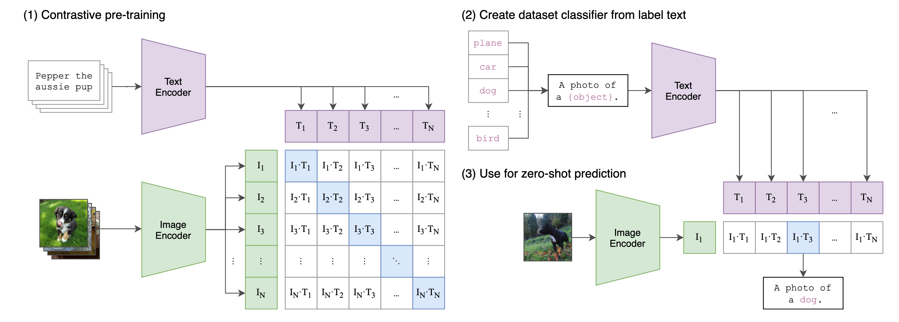

\[2021-03]\[CLIP] Learning Transferable Visual Models From Natural Language Supervision

# \[CLIP] Learning Transferable Visual Models From Natural Language Supervision

## 概述

同学你好！很高兴能为你解读这篇在计算机视觉（CV）领域具有里程碑意义的论文——**CLIP**（Contrastive Language-Image Pre-training）。这篇论文由 OpenAI 发表，它的出现打破了视觉模型只能识别固定类别的僵局。

为了让你快速理解，我将从以下几个维度为你深度拆解：

***

### 1. 本论文要解决什么问题？为什么重要？

**要解决的问题：** 传统的计算机视觉模型（如著名的 ResNet）就像是一个“偏科生”。它们通常是在像 ImageNet 这样的人工标注数据集上训练的，只能识别固定的类别（比如 1000 种物体）。如果你想让它识别第 1001 种物体，你必须重新收集大量标签数据并微调模型。

**重要性：**

*   **成本极高：** 人工标注数据既昂贵又慢，无法覆盖互联网上无穷无尽的视觉概念。
*   **通用性差：** 固定类别的模型在现实世界中很脆弱，一旦遇到没见过的东西或者光影变化稍大的场景，性能就会大幅下降。
*   **目标：** 我们需要一个像人类一样，通过看图和读文字就能学习，且能直接处理各种新任务的“全才”模型。

***

### 2. 解决这个问题的难点在哪里？之前的方案为什么不行？

**难点：**

1.  **语言的复杂性：** 自然语言是高度非结构化的，如何让机器理解“一只在草地上奔跑的金色拉布拉多”和图片的关系，比让它理解“标签 ID=251”难得多。
2.  **效率问题：** 如果让模型去“预测”图片对应的每一个单词（生成式学习），计算量大得惊人，训练速度极慢。

**之前的方案：**

*   **方案 A（预测标签/标签）：** 限制了模型的视野，无法处理没见过的概念。
*   **方案 B（预测文本描述）：** 比如 VirTex 尝试让模型预测图片的完整标题。
*   **失败原因：** 预测每一个词（类似填空题）太难了，模型会把大量精力浪费在语法和无关痛痒的单词上，导致学习视觉特征的效率极低。

***

### 3. CLIP 提出了什么解决方案？为什么能成功？

**解决方案：** CLIP 放弃了“填空题”，改做\*\*“连线题”\*\*。

它从互联网上搜集了 **4 亿对**（图片, 文本）组合。在训练阶段，它同时训练一个“图像编码器”和一个“文本编码器”。

*   **核心逻辑（对比学习）：** 给定一批图片和描述，让模型去预测哪张图和哪段话是一对。模型只需要把“正确匹配”的得分拉高，把“错误匹配”的得分压低即可。

**为什么能解决问题：**

*   **效率高：** “连线题”比“填空题”简单，模型能更快地在大规模数据中捕捉到核心视觉概念。
*   **零样本迁移（Zero-shot）：** 训练完后，模型并不绑定任何固定类别。如果你想测试它能否识别“宇航员”，你只需要输入一句话：“一张宇航员的照片”，模型就会计算图片与这句话的相似度。这赋予了模型极强的通用性。

***

### 4. 方案的核心创新点在哪里？

1.  **海量数据（Scale）：** 利用 4 亿对互联网抓取的原始数据，绕过了人工标注的瓶颈。
2.  **对比学习（Contrastive Learning）：** 证明了对于多模态学习，对比任务比生成任务高效得多。
3.  **自然语言作为标签：** 它是第一个大规模证明“不需要固定标签，仅靠自然语言引导就能达到甚至超越监督学习效果”的模型。
4.  **Prompt Engineering（提示工程）：** 在测试阶段，通过构造类似“一张{类别}的照片”这样的提示词，显著提升了识别准确率。

***

### 5. 本方案有什么局限性？

1.  **细粒度分类较弱：** 虽然它很懂“宇航员”，但在区分非常相似的车型、花种，或者数清楚图片里有几个苹果（计数任务）时，表现不如专门训练的小模型。
2.  **抽象任务无力：** 对于一些专业领域（如医学影像分类、卫星图像解析），如果训练数据里没见过，它也无法凭空变出来。
3.  **对手写体识别（MNIST）极差：** 令人意外的是，它识别手写数字的准确率竟然不如几十年前的老模型，这可能是因为互联网数据中很少有这种纯手写数字配文字说明的例子。
4.  **社会偏见：** 因为数据来自互联网，它不可避免地学到了人类的偏见（如性别、种族偏见）。

***

### 6. 关键架构图解读（图 1 与 图 3）

你可以重点观察论文的前几页图表，它们是理解 CLIP 的钥匙：

*   **图 1 (Figure 1) - CLIP 的工作流程：**

    *   **Part 1 (训练)：** 左侧是图片进入 Image Encoder，上方是文本进入 Text Encoder，中间形成一个巨大的矩阵。矩阵对角线上的元素是“正确配对”，训练目标就是让对角线上的值最大。
    *   **Part 2 & 3 (预测)：** 这里展示了如何做“零样本分类”。模型先把所有可能的标签（如“鸟”、“狗”、“车”）变成句子，通过文本编码器得到特征，再看图片特征和哪个句子的特征最接近。这辅助理解了模型是如何摆脱固定标签限制的。

*   **图 2 (Figure 2) - 效率对比图：**

    *   这张图非常重要，它展示了对比学习（图中绿色线）在 ImageNet 上的学习效率远远超过了预测单词的方案（图中蓝线和橙线）。它直观地告诉学生：**方法选对了，效率能提升 4 倍以上。**

*   **图 13 (Figure 13) - 鲁棒性对比：**

    *   它展示了当测试数据发生“分布偏移”（比如从实拍图变成素描图或卡通图）时，CLIP 的表现非常稳健，而传统的 ResNet 性能会雪崩。这辅助理解了为什么自然语言监督能带来更强的鲁棒性。

希望这份解读能帮你跨越理解 CLIP 的门槛！如果还有细节不清楚，随时问我。
