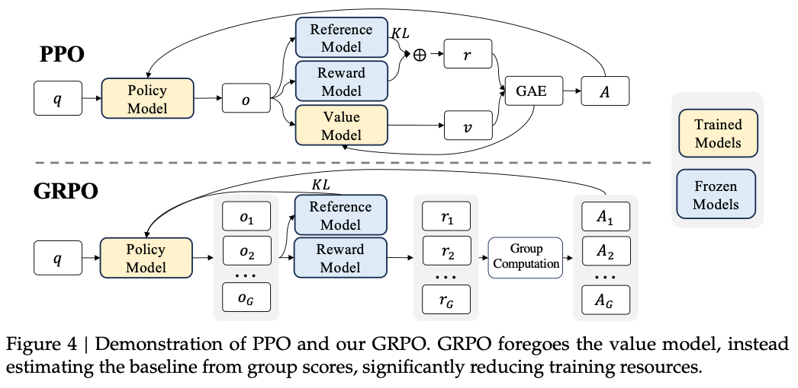

\[2024-02]\[DS-Math] DeepSeekMath: Pushing the Limits of Mathematical Reasoning in Open Language Models

# \[DS-Math] DeepSeekMath: Pushing the Limits of Mathematical Reasoning in Open Language Models

## 概述

你好！很高兴为你解读这篇在开源模型界引起轰动的论文——**DeepSeekMath**。

DeepSeekMath 7B 在竞赛级的 MATH 基准测试中达到了 **51.7%** 的准确率，这已经接近了像 GPT-4 这种顶级闭源模型的水平。作为一个 7B（70 亿参数）的小规模模型，它是如何实现这种“越级挑战”的？

我们可以从以下几个维度来深入拆解：

***

### 1. 本论文要解决什么问题？为什么重要？

**要解决的问题：** 如何显著提升开源语言模型（LLM）的**数学推理能力**，使其在不依赖外部工具（如计算器、代码解释器）的情况下，也能解决复杂的数学难题。

**重要性：**

*   **推理的试金石：** 数学被公认为衡量 AI “逻辑思维”和“推理能力”的最高标准之一。
*   **开源的差距：** 长期以来，开源模型在数学推理上远落后于 GPT-4、Gemini 等闭源巨头。如果能在开源小模型上实现强大的数学推理，意味着 AI 的平权——让普通研究者也能在本地运行具备高级逻辑能力的模型。

***

### 2. 难点在哪里？之前的方案为什么不行？

**主要难点：**

1.  **高质量数据稀缺：** 互联网上虽然有大量文本，但高质量的数学公式和推理步骤（Chain-of-Thought）占比极小。
2.  **强化学习（RL）成本极高：** 传统的强化学习算法（如 PPO）在训练时需要同时加载多个模型（策略模型、参考模型、奖励模型、价值模型/判别器），非常吃显存，且训练过程不稳定。

**之前的方案：**

*   **依靠专业书籍或 arXiv 论文：** 数据量太小（如数十亿 token），模型学得不够宽。
*   **合成数据：** 用 GPT-4 生成数学题。虽然质量高，但容易产生“偏食”，缺乏互联网真实世界的多样性。

***

### 3. 本论文提出了何种解决方案？

DeepSeek 团队从**数据**和**算法**两个核心点发力：

*   **数据层面（DeepSeekMath Corpus）：** 他们没有局限于学术论文，而是开发了一套精密的流水线，从海量的 Common Crawl（网页快照）中“淘金”。通过迭代式的数据筛选，硬生生挖掘出了 **120B（1200 亿）token 的高质量数学网页数据**。
*   **算法层面（GRPO）：** 提出了一种全新的强化学习算法——**GRPO（Group Relative Policy Optimization，组内相对策略优化）**。

***

### 4. 方案的核心创新点在哪里？

这是本论文最亮眼的地方：

**创新点 A：数据筛选流水线（图 2）** 他们不是简单地用关键词搜数学题。他们先用已有的高质量数学数据训练一个分类器（fastText），然后去网页库里找相似数据，接着识别出这些数据来自哪些域名（比如 mathoverflow\.net），再对这些域名下的新路径进行人工标注和分类器更新。这种“滚雪球”的方式确保了数据的多样性和纯度。

**创新点 B：GRPO 算法（核心突破，图 4）** 传统的 PPO 算法需要一个专门的“判别器（Critic）”模型来打分，这个模型和主模型一样大，非常占内存。 **GRPO 的天才之处在于：** 针对同一个数学问题，它让模型一次性生成一组（比如 64 个）答案。它不看绝对分数，而是让这些答案**互相比较**。

*   算这一组答案的平均分。
*   高于平均分的答案被奖励，低于平均分的被惩罚。
*   **结果：** 不需要“判别器”模型了，显存占用直接砍掉一大截，训练效率翻倍，且效果更好。

***

### 5. 局限性与劣势？

尽管 DeepSeekMath 很强，但它仍有不足：

*   **几何与复杂定理证明：** 在需要图形思维和极端严谨证明的领域，它依然弱于 GPT-4 这种大尺度的模型。
*   **Few-shot 能力：** 受限于 7B 的参数规模，在通过极少量例子（Few-shot）学习新任务时，小模型的理解上限不如超大规模模型。
*   **幻觉问题：** 强化学习虽然能提升正确率，但有时会导致模型为了拿高分而出现过度拟合某些特定题型的倾向。

***

### 6. 关键架构图/流程图解读

这篇论文中有两张图对于理解核心思路至关重要：

#### **图 2：数据收集流水线（Data Pipeline）**

*   **内容：** 展示了一个闭环。从“数学种子数据”出发 -> 训练分类器 -> 从网页库找相关页面 -> 识别数学域名 -> 人工标注更新分类器。
*   **辅助理解点：** 它解释了 120B 的高质量数据是怎么来的。它点明了“数学能力不仅仅来自教科书，互联网的角落里藏着大量未被利用的推理数据”。

#### **图 4：PPO vs GRPO 的对比图（重点！）**

*   **内容：**

    *   **上半部分（PPO）：** 结构复杂，有 Policy Model（策略模型）、Value Model（价值模型/判别器）、Reward Model（打分模型）。
    *   **下半部分（GRPO）：** 结构极简。**Value Model 被去掉了**，取而代之的是一个 "Group Computation（组内计算）" 的方框。

*   **辅助理解点：** 这张图一眼就能看明白为什么 GRPO 省资源。它变“绝对打分”为“相对竞争”，把复杂的模型架构变成了数学上的组内均值计算。这是该模型能在有限资源下完成大规模强化学习的关键原因。

***

### **总结给学生的话：**

DeepSeekMath 告诉我们：**“大力出奇迹”不只是加机器，还要会“淘数据”和“简化算法”。** 它的成功在于证明了：只要数据足够干净、算法（GRPO）足够聪明地利用群体相对优势，7B 的小模型也能在顶级推理任务上硬刚 AI 巨头。

## 思考一

1.  PPO中的Value Model（价值模型/判别器）、Reward Model（打分模型）、Reference Model分别都有什么用？
2.  GRPO中仍然有Reward Model（打分模型）、Reference Model，使用上和PPO中的使用方法有什么不同？

***

为了更深入地理解 DeepSeekMath 的核心贡献，我们需要把这几个模型的职责拆解清楚。强化学习（RL）就像是在**教学生（Policy）考试**，而这些辅助模型分别扮演了不同的角色。

***

### 1. PPO 中的模型各司其职

在传统的 PPO 算法中，通常需要**四个**模型同时运行（显存压力极大）：

*   **Policy Model（策略模型/演员）：**

    *   **作用：** 这就是我们要训练的那个大模型（比如 DeepSeek 7B）。它负责生成答案。
    *   **目标：** 学习如何生成能拿到高分（Reward）的答案。

*   **Reference Model（参考模型/定海神针）：**

    *   **作用：** 一个冻结住的、刚经过微调（SFT）后的模型版本。
    *   **理由：** 强化学习很容易“练废”，模型为了拿高分可能会产生一堆乱码或怪异的表达（即“奖励作弊”）。Reference Model 的存在是**为了约束 Policy Model**：你拿高分可以，但你的说话方式不能偏离原始模型太远（通过 KL 散度来计算两者的相似度）。

*   **Reward Model（打分模型/法官）：**

    *   **作用：** 这是一个客观的法官。模型每生成一个完整的答案，打分模型就给出一个分数（比如 0.1 到 1.0）。
    *   **局限：** 它只告诉模型结果好不好，不告诉模型中间哪一步走错了。

*   **Value Model（价值模型/预测师/判别器）：**

    *   **作用：** **这是 PPO 中最吃显存的家伙。** 它的任务是预测“当前的这步状态，最终大约能拿多少分”。
    *   **意义：** 它是为了辅助计算“优势（Advantage）”。比如打分模型给了 0.9 分，如果 Value Model 预判只能拿 0.5 分，那说明这波操作“超常发挥”了，要重奖；反之，如果预判能拿 0.95 分却只拿了 0.9，那就是“表现退步”了。它能**降低训练的波动性**。

***

### 2. GRPO 中，Reward 和 Reference Model 的用法有何不同？

DeepSeek 提出的 GRPO 最大的创新就是**砍掉了 Value Model**，但保留并优化了 Reward 和 Reference Model 的使用逻辑。

#### **Reward Model（从“绝对评分”变为“组内海选”）**

*   **PPO 的用法：** 答案给 Reward Model -> 得到一个绝对分数 -> 交给 Value Model 去对比 -> 算出一个“进步值”。

*   **GRPO 的用法：**

    1.  **群体取样：** 针对一个问题，让模型一口气生成 **G个（比如 64 个）** 答案。
    2.  **组内相对化：** 让 Reward Model 给这 64 个答案分别打分。
    3.  **平均 baseline：** 计算这 64 个分数的**平均值和标准差**。
    4.  **奖励逻辑：** **在这个组里表现高于平均分的就奖励，低于平均分的就惩罚。**

*   **核心差异点：** GRPO 不再需要 Value Model 去“猜测”基准线，而是直接用这 64 个样本当作基准线。这就像是 PPO 在做“绝对值评价”，而 GRPO 在做“班级内部排名”。

#### **Reference Model（从“隐式约束”变为“显式惩罚”）**

*   **PPO 的用法：** 通常将 Reference Model 计算出的 KL 散度（偏差值）**加到 Reward 分数里**。相当于：`最终得分 = 任务得分 + 语言像不像人的奖励`。这样会导致计算 advantage 时逻辑比较复杂。

*   **GRPO 的用法（图 13/14 对应的公式）：**

    1.  **直接加在 Loss 里：** GRPO 在优化目标函数时，直接把 KL 散度作为一个**单独的正则项（Penalty）** 减去。
    2.  **显式约束：** 这样做让计算更简单，同时也让优势函数（Advantage）纯粹只关注 Reward 分数。
    3.  **计算方式优化：** GRPO 使用了一个更简洁的 KL 散度估计器（Schulman 2020），减少了计算开销。

***

### **总结对比表**

| 组件                  | PPO 的做法          | GRPO 的做法              | 带来的好处             |
| ------------------- | ---------------- | --------------------- | ----------------- |
| **Value Model**     | 必须有，专门训练一个模型预测分数 | **完全取消**              | 节省约 50% 的显存占用     |
| **Reward Model**    | 给单个答案打绝对分        | 给一组答案打分，**算组内排名**     | 训练更稳定，基准线（Mean）更准 |
| **Reference Model** | 偏差值混入 Reward 分数中 | **直接在 Loss 函数中减去偏差项** | 计算路径更清晰，优化更直接     |

**给学生的小结：** 你可以理解为，PPO 是请了一个专门的\*\*“预言家（Value Model）”**来猜你能考多少分；而 GRPO 是直接让模型**“多考几次（Group Samples）”\*\*，用这几次的平均分当参考。因为省掉了预言家，模型的训练速度更快，腾出的显存可以支持更大的 Batch Size 或者更长的序列。
