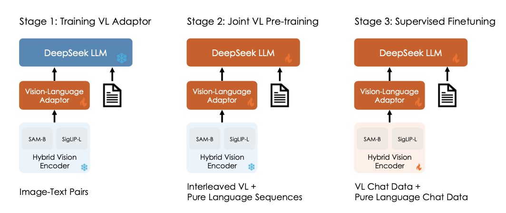

\[2024-03]\[DS-VL] DeepSeek-VL: Towards Real-World Vision-Language Understanding

# \[DS-VL] DeepSeek-VL: Towards Real-World Vision-Language Understanding

## 概述

你好！作为一名 AI 研究员，很高兴能为你解读 DeepSeek-VL 这篇论文。

DeepSeek-VL 是由深度求索（DeepSeek）团队开发的一个**开源视觉语言（Vision-Language, VL）模型**。简单来说，它不仅能读懂文字，还能看懂图片。目前它发布了 1.3B（13亿）和 7B（70亿）两个版本。

以下是针对这篇论文的深度解读：

### 1. 本论文要解决什么问题？

目前的开源多模态模型（也就是能看图的模型）在学术测试集上表现不错，但在**真实世界**的应用中却经常“翻车”。

**为什么要解决这个问题？** 因为我们希望 AI 助手能处理现实生活中的复杂任务，比如看懂网页截图、分析长篇 PDF、识别复杂的图表、甚至是理解手机 App 界面。如果模型只会在实验室环境里识别“猫和狗”，它就无法成为真正的生产力工具。

***

### 2. 难点在哪里？之前的方案为什么不行？

解决真实场景的理解有三个核心障碍：

*   **分辨率不够（看得模糊）：** 之前的模型大多把图片缩放到很小的尺寸（如 336x336）。这就像是高度近视的人看书，大图能看清，但 PDF 里的细小文字或零件细节根本看不见。
*   **“大脑”偏科（语言能力下降）：** 在教模型“看图”的过程中，如果处理不好，模型原本强大的语言逻辑能力会退化（学术上叫“灾难性遗忘”）。这导致模型虽然看懂了图，但说起话来变得前言不搭后语。
*   **数据不真实（纸上谈兵）：** 很多开源模型是用学术界的标准数据集训练的，而真实用户可能会给模型发一张杂乱的桌面照片或一张复杂的业务报表。

***

### 3. 本论文提出了何种解决方案？

DeepSeek-VL 从三个维度给出了答案：

*   **混合视觉编码器（Hybrid Vision Encoder）：**

    *   它给模型装了两只“眼睛”：一只负责看**宏观语义**（比如：这是一张风景照），另一只负责看**微调细节**（分辨率达到 1024x1024，能看清小字）。

*   **语言优先的训练策略：**

    *   团队认为，一个好的多模态模型，前提必须是一个好的语言模型。他们在训练中强制保留了至少 **70% 的纯文本数据**，并采用“渐进式”的方法加入图片数据，防止模型变傻。

*   **基于真实场景的数据构建：**

    *   他们专门整理了一套涵盖网页截图、PDF、OCR（文字识别）、图表、教科书等真实场景的数据集。

***

### 4. 方案的核心创新点在哪里？

这是理解 DeepSeek-VL 的关键：

1.  **“低成本、高效率”的 1024 分辨率：** 传统的 1024 分辨率处理起来非常吃算力。DeepSeek-VL 通过一种巧妙的“特征融合”技术，在保持高分辨率的同时，将图片信息压缩成较少的 Token（只有 576 个），这让模型在推理时既快又省钱。
2.  **多模态预训练配方（Modality Warm-up）：** 他们发现直接把图文混在一起练，模型容易“懵”。于是他们先让模型练语言，然后慢慢增加图片比例，像温水煮青蛙一样让模型平滑地学会看图。
3.  **细致的用例分类法（Taxonomy）：** 他们根据真实用户的需求，把任务分成了：识别、转换、分析、常识推理、逻辑推理等，并针对性地喂数据，这让它的“用户体验”比同类模型更好。

***

### 5. 本方案有什么局限性？

虽然 DeepSeek-VL 很强，但也有其局限：

*   **绝对逻辑能力的差距：** 与 GPT-4V 或 Gemini 等巨型闭源模型相比，受限于模型参数量（只有 7B），它在极复杂的数学逻辑推理上仍有差距（见论文 Table 5，MathVista 得分虽领先同类，但仍低于 GPT-4V）。
*   **模型规模：** 目前发布的版本规模较小。虽然小规模适合部署在个人电脑上，但处理极端复杂的长文本+多图关联任务时，可能不如千亿级参数的模型。

***

### 6. 关键图表解读

在论文中，有几个图表对理解核心思路至关重要：

*   **Figure 3（训练流程图）：**

    *   **内容：** 展示了模型训练的三个阶段：

        1.  **Stage 1：** 只练“视觉到语言”的转换器（Adaptor），模型身体动，大脑不动。
        2.  **Stage 2：** 核心阶段。视觉和语言一起练（Joint Pre-training），大脑开始学习看图。
        3.  **Stage 3：** 针对具体指令进行微调（SFT），让模型学会如何更好地回答人的指令。

    *   **辅助理解：** 这一图表点明了 DeepSeek-VL 是如何通过“三步走”战略，在不损坏原有语言能力的前提下，习得视觉能力的。

*   **Figure 4（模态混合比例实验）：**

    *   **内容：** 展示了不同比例的文本和图片数据对模型表现的影响。
    *   **辅助理解：** 这张图证明了论文的一个核心观点：如果图片数据喂得太多（比如 100% 都是图文数据），模型的语言能力会暴跌。最终确定的 **7:3（文本占 7 成）** 是保持平衡的“黄金比例”。

*   **Figure 10（视觉编码器对比）：**

    *   **内容：** 比较了不同视觉模型（CLIP, SigLIP, SAM 等）在训练过程中的收敛情况。
    *   **辅助理解：** 它解释了为什么要用“混合眼睛”。实验证明，这种混合设计比单一的视觉编码器下降得更快、更稳，效率更高。

### 总结给学生的话：

DeepSeek-VL 就像是一个原本很聪明的**文科生**（DeepSeek-LLM），研究员们通过**混合双眼**（高低分辨率结合）和**科学的食谱**（7:3 的图文比例），成功地把他培养成了**全才**。他在看图说话、分析报表方面已经达到了同级别选手的顶尖水平。

## 思考一

1.  展开解释一下如何在保持高分辨率的同时，将图片信息压缩成较少的 Token？
2.  "先让模型练语言，然后慢慢增加图片比例"，这里需要图片和语言之间在语义上有关联吗？
3.  解释一下如何"针对性地喂数据"？
4.  解释一下stage1，什么叫模型身体动，大脑不动？

***

非常棒的问题！这些问题都触及了多模态模型设计的精髓。作为研究员，我再为你深度拆解一下这些技术细节。

***

### 1. 如何在保持 1024 高分辨率的同时压缩 Token？

这是一个\*\*“既要看得清，又要跑得快”**的矛盾。在 DeepSeek-VL 中，它是通过**混合编码器（Hybrid Encoder）**和**步长卷积（Strided Convolution）\*\*来实现的。

*   **双路并行（眼睛的组合）：**

    *   **低分辨率“远视眼”：** 使用 SigLIP 编码器看 384x384 的图，提取整张图的“大概意思”（语义信息）。
    *   **高分辨率“近视眼”：** 使用 SAM-B 编码器看 1024x1024 的图。它不关心大局，专门捕捉细小的边缘、文字笔画等细节（特征图）。

*   **物理压缩（Token 消失术）：**

    *   1024x1024 的图片如果直接放进模型，信息量巨大。DeepSeek-VL 在高分辨率这路做了一个关键操作：**池化与卷积**。
    *   它将 SAM 产生的特征图（原本很大）通过两层**步长为 2 的卷积层**。你可以理解为用一个 2x2 的方格在图上滑动，每 4 个像素点的特征被聚合成 1 个。

*   **最终形态：** 经过这样“压缩”后的 1024 分辨率特征，和 384 分辨率的语义特征拼在一起，最终只占用 **576 个 Token**。

    *   **通俗比喻：** 就像是一张高清地图，我不是把每个像素都打印给你看，而是把地图切成 576 个小方块，每个方块用一句话总结：“这块有个红色的垃圾桶”或者“这块有个字母 A”。模型处理的是这 576 句总结，而不是原始像素。

***

### 2. “慢慢增加图片比例”时，语义有关联吗？

这里的“增加比例”指的是**训练数据包（Batch）的构成成分**，而不是指图片和文字的乱序组合。

*   **数据必须有关联：** 在每一组\*\*“图片+文字”\*\*的训练样本里，它们必须是严格语义关联的。比如图片是一张菜单，文字必须是“这张菜单里最贵的菜是什么？”。如果图文不符，模型就学乱了。

*   **所谓的“练语言”和“加比例”是指：**

    *   **起步阶段：** 一个训练小队里，100 个样本可能全都是纯文字（比如维基百科、代码）。此时模型在温习逻辑、说话方式和编程知识。
    *   **过渡阶段：** 慢慢地，100 个样本里加入了 5 个“图文对”，然后增加到 10 个、20 个。
    *   **最终稳定：** 达到 30% 是图文关联数据，70% 是纯文字数据。

*   **为什么要这么做？**

    *   如果一开始就塞进大量图文数据，模型会觉得“视觉信号太强烈了”，从而忽略了文字逻辑。这种策略是为了让模型在**稳住大脑逻辑（语言）的前提下，慢慢学会用眼睛（视觉）辅助思考**。

***

### 3. 如何“针对性地喂数据”？

这就是 DeepSeek-VL 提到的 **使用场景分类法（Use Case Taxonomy）**。这不像以前那样“抓到什么喂什么”，而是像给学生准备**科学教材**。

*   **建立分类树：** 团队把真实世界的需求分成了几个大类（见论文 Table 3）：

    *   **识别类：** 找找图里有什么？
    *   **转换类：** 把图片里的表格转成 Excel，或者把网页截图转成 HTML 代码。
    *   **分析类：** 读读这个股票走势图。
    *   **逻辑推理类：** 给出两张图，找出它们的不同点。

*   **配比控制：**

    *   如果模型 OCR（识字）能力弱，就多喂点带文字的截图；如果模型不会写代码，就多喂点“网页截图+前端代码”的对应数据。

*   **混合纯文本 SFT：**

    *   在微调阶段，他们还混入了大量的纯文本对话（约占 48%）。这样是为了保证模型在看图说话时，依然像一个高情商、有逻辑的聊天机器人，而不是变成一个只会冷冰冰识别物体的机器。

***

### 4. Stage 1：什么叫“模型身体动，大脑不动”？

在深度学习中，“动”意味着**参数更新（学习）**，“不动”意味着**参数冻结（不修改）**。

*   **大脑（LLM）不动：** DeepSeek-LLM 这个已经学富五车的语言模型被锁死了。为什么要锁死？因为此时模型还没见过图片，如果强行让它学习图片，它会因为“不适应”而把原本记下的语言知识搞乱。

*   **眼睛（Vision Encoder）不动：** 视觉编码器也是预训练好的，它看图的能力已经很强了，暂时不需要改。

*   **身体（VL Adaptor/连接器）在动：**

    *   这是最关键的部分。视觉编码器输出的是“视觉信号”，语言模型输入的是“文字向量”。这两者的信号频率完全不同。
    *   **Stage 1 的唯一任务：** 训练中间那个起桥梁作用的微小模块（通常是一个两层的 MLP 神经网络）。
    *   **通俗比喻：** 语言模型是个“盲人天才”，视觉编码器是个“失语的摄影师”。Stage 1 不教天才新知识，也不教摄影师拍新片，而是专门训练那个**翻译官**。让翻译官学会把摄影师拍到的图像，翻译成盲人天才听得懂的“语言描述”。

**总结一下：** Stage 1 是为了**对齐**，让模型实现从“看不见”到“能听见视觉描述”的跨越，而不去动模型的核心智力。
