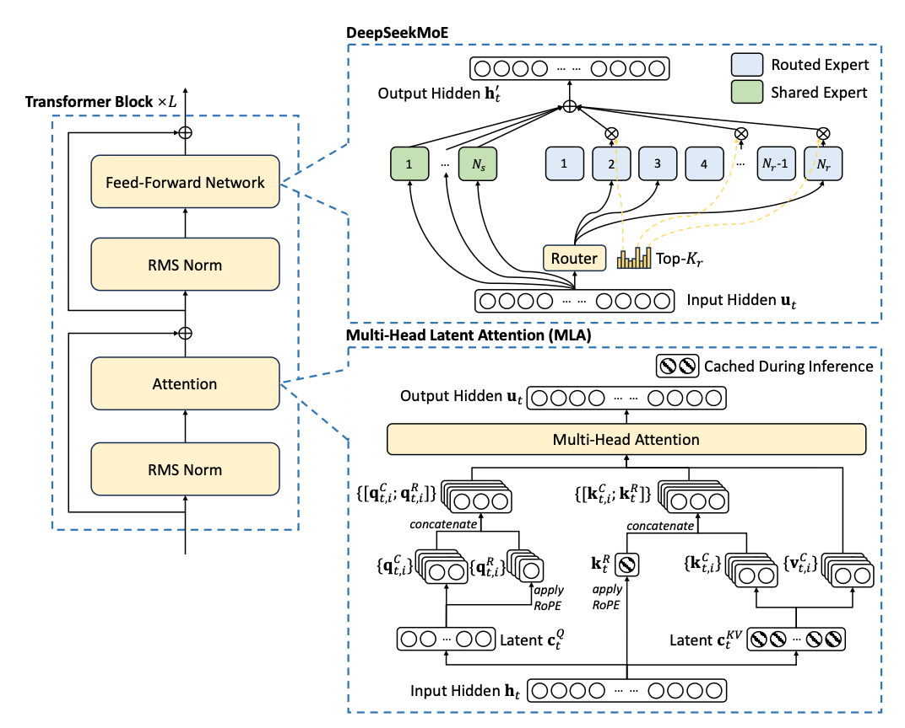

\[2024-05]\[DS-V2] DeepSeek-V2: A Strong, Economical, and Efficient Mixture-of-Experts Language Model

# \[DS-V2] DeepSeek-V2: A Strong, Economical, and Efficient Mixture-of-Experts Language Model

## 概述

你好！很高兴能为你解读这篇具有里程碑意义的论文——**DeepSeek-V2**。

DeepSeek-V2 是目前大模型领域非常火爆的模型，它的出现让大家意识到：**模型不一定要靠堆算力、堆显存才能变强，精巧的设计能让大模型变得既聪明又便宜。**

以下是对这篇论文的深度解读：

***

### 1. 这篇论文要解决什么问题？为什么重要？

**核心问题：** 解决大语言模型（LLM）中\*\*“性能”与“效率”不可兼得\*\*的矛盾。

**重要性：** 随着模型参数量的增加，模型虽然变得更聪明（涌现能力），但带来了两个巨大的代价：

*   **训练太贵：** 需要成千上万张昂贵的显卡（如 H800）跑好几个月，消耗数千万甚至上亿元。
*   **推理太慢/太占内存：** 尤其是“KV Cache”（键值缓存）占用了巨大的显存。如果你想让模型处理超长的文本（比如读一整本书），显存很快就会爆掉，且回复速度会变慢。

DeepSeek-V2 的目标就是：**用更少的钱训练出更强的模型，同时让推理速度飞起来。**

***

### 2. 解决这个问题的难点在哪里？之前的方案有哪些缺陷？

**难点：** 在压缩模型内存占用（尤其是注意力机制）的同时，如何不让模型的“智商”下降？

**之前的解决方案及其不足：**

1.  **注意力机制方面（MHA, GQA, MQA）：**

    *   **MHA（多头注意力）：** 效果最好，但 KV Cache 极大，推理长文本时极其费显存。
    *   **MQA/GQA（多查询/分组查询注意力）：** 为了省显存，强行减少了缓存的数据。这虽然省了空间，但模型捕捉复杂信息的能力会下降，智商会有所损失。

2.  **模型架构方面（传统 MoE）：**

    *   **GShard 等传统架构：** 专家（Expert）切分得比较粗糙。每个 token（字符）在选择专家时，容易出现“专家忙闲不均”的情况，且专家之间的知识冗余较多，效率不够极致。

***

### 3. 本论文提出了何种解决方案？

DeepSeek-V2 提出了两个核心“黑科技”：

1.  **MLA (Multi-head Latent Attention，多头潜变量注意力)：**

    *   **原理：** 它不再像传统方式那样存储完整的 KV 矩阵，而是通过“低秩压缩”技术，把原本巨大的信息压缩成一个很小的“潜向量”（Latent Vector）。
    *   **比喻：** 以前模型存储信息像存未经压缩的 4K 视频，而 MLA 就像是自研了一套极致的压缩算法（类似于把视频转成了超高清的 HEVC 格式），存储空间缩小了 90% 以上，但画质（智商）几乎没变。

2.  **DeepSeekMoE（深度求索混合专家架构）：**

    *   **原理：** 采用“更细粒度”的专家切分。它把专家分成了“共享专家”（Shared Experts）和“路由专家”（Routed Experts）。
    *   **比喻：** 就像一个大型工厂，不再是分 8 个全能大车间，而是分成 160 个专业小班组。其中有几个班组是“全能常驻”的（处理基础知识），其余的小班组则是“术业有专攻”（处理特定问题）。

***

### 4. 方案的核心创新点在哪里？

*   **MLA 的极致压缩：** 相比 DeepSeek-67B（上一代模型），MLA 将 **KV Cache 减少了 93.3%**。这意味着同样的显存，以前只能让模型回复 10 个人，现在能同时回复 100 多个人。
*   **激活参数与总参数的巨大差异：** DeepSeek-V2 总参数量有 **236B**（2360 亿），但每次处理一个词时，只有 **21B** 参数在干活。这种“总参数大（代表知识储备多）+ 激活参数小（代表计算成本低）”的组合是其经济高效的秘诀。
*   **极其低廉的训练成本：** 相比同级别的稠密模型，它节省了 **42.5%** 的训练成本。

***

### 5. 本方案有什么局限性？劣势在哪里？

*   **基础能力的微小差距：** 论文中提到，虽然 DeepSeek-V2 在很多领域非常强，但在极少数基础英语能力上，距离 LLaMA 3 70B 还有非常细微的差距。
*   **“对齐税”问题：** 经过强化学习（RL）对齐后的版本，虽然在对话和逻辑上变强了，但在某些标准测试集（如 BBH）上的表现会有轻微下降（即为了让模型更好用，牺牲了一点点原始答题能力）。
*   **模态限制：** 目前 DeepSeek-V2 主要还是针对**文本**模态，暂不支持原生多模态（如直接理解图像或视频）。
*   **硬件依赖：** MLA 和细粒度 MoE 对底层算子（CUDA Kernel）的优化要求极高，如果直接用通用的框架跑，可能跑不出论文里那种极致的效率。

***

### 6. 关键架构图解读（Figure 2）

论文第 5 页的 **Figure 2** 是理解 DeepSeek-V2 的核心。你可以结合截图看： 

1.  **左侧（Transformer Block）：** 展示了模型的基本组成，依然由 RMS Norm、Attention（注意力）和 FFN（前馈网络）组成。

2.  **右上方（DeepSeekMoE）：**

    *   你可以看到 `Shared Expert`（绿色块）是每个 token 必经的。
    *   `Routed Expert`（蓝色块）则是根据 `Router`（路由器）计算出的分数，选出最合适的几个小班组（Top-K）来处理。这体现了“按需分配”的思想。

3.  **右下方（MLA）：**

    *   注意看那个 `Latent c` 的圆圈。它是把所有的 Key 和 Value 压缩进这个小圆圈里存储。
    *   在计算时，它会通过一个 `apply RoPE` 的分支来处理位置信息。这种“解耦旋转位置嵌入”的设计，既保证了压缩效率，又让模型能记住词与词之间的位置关系。

**总结：** 这张图辅助我们理解了：DeepSeek-V2 就像是一个配备了“高效压缩大脑”（MLA）和“精细化分工团队”（DeepSeekMoE）的超级大脑，它能在极低的运行内存下，动用庞大的知识库解决问题。

希望这个解读能帮你快速掌握 DeepSeek-V2 的精髓！如果还有关于细节的问题，欢迎继续提问。

## 思考一

1.  解释一下MLA是如何把信息压缩成很小的"潜向量"又能不影响效果的？
2.  MLA中的apply RoPE具体是怎么做的？这么做的作用是什么？
3.  DeepSeekMoE和之前论文（arXiv:2401.04088，Mixtral of Experts）中的MoE在模型结构，训练和推理时的数据流和工作流上有什么本质区别？与之前的MoE相比，有什么优势？

***

很高兴看到你对技术细节进行了如此深入的思考！这三个问题正击中了 DeepSeek-V2 论文中最核心的架构创新。

作为研究员，我用更直观、更具工程视角的逻辑为你逐一拆解：

***

### 1. MLA 它是如何实现“极致压缩”且“不掉智商”的？

在传统的 Transformer 中，KV Cache（键值缓存）是性能瓶颈。之前的方案（如 GQA/MQA）是直接“砍掉”一部分 Head（头），这本质上是减少了信息的维度，所以会掉智商。

**MLA 的做法是：低秩矩阵分解（Low-Rank Compression）。**

*   **如何压缩：MLA 不再直接存每个 Head 的 Key 和 Value。它通过一个下投影矩阵 $W^{DKV}$ ，把高维的隐藏状态（比如 5120 维）压缩成一个很小的潜向量$c_t^{KV}$**（比如 512 维）。在显存里，我们**只存这 512 维的潜向量**。
*   **如何不影响效果（秘诀在于“吸收”）：当我们需要计算注意力时，理论上需要把这 512 维“升频”回原来的多头格式。但 MLA 发现了一个数学上的“偷懒”办法：矩阵乘法满足结合律**。原本是 `(潜向量 × 升投影矩阵) × Query`，我们可以变形成 `潜向量 × (升投影矩阵 × Query)`。这意味着：**在推理时，我们根本不需要在内存里还原出那个巨大的 KV 矩阵。** 我们直接把“升投影矩阵”合并到 Query 的计算过程中。
*   \*\*结论：\*\*它在存储上是“压缩”的（省显存），但在表达力上通过升投影矩阵保持了“多头”的高复杂度（不掉智商）。

***

### 2. MLA 中的 `apply RoPE` 具体是怎么做的？作用是什么？

这是 MLA 设计中最精巧的地方，解决了\*\*“压缩”与“位置感”的冲突\*\*。

*   **矛盾点：RoPE（旋转位置编码）是现代大模型的标配，它是位置敏感**的。如果你把位置信息直接注入到那个“潜向量”里，因为每个词的位置都在变，你就没法利用上面提到的“矩阵结合律”来吸收升投影矩阵了（位置矩阵夹在中间，结合律失效）。

*   \*\*具体做法（解耦设计）：\*\*MLA 将 Query 和 Key 每一路都拆成了两部分：

    1.  **内容向量（Content）：** 这部分走上面的“低秩压缩”路径，**不加 RoPE**。它负责理解“这个词是什么意思”。
    2.  **位置向量（RoPE）：** 额外开辟一小部分维度，专门用来**挂载 RoPE**。它负责理解“这个词在哪里”。

    *   对于 Key：所有 Head **共享**一个位置向量  $k_t^R$ 。

    *   对于 Query：每个 Head 有自己独立的位置向量  $q_{t,i}^R$ 。

*   \*\*作用：\*\*通过这种“解耦”，内容信息可以被极致压缩并利用结合律加速，而位置信息则独立运行，互不干扰。这使得模型在拥有超长上下文（128K）位置感的同时，KV Cache 依然极小。

***

### 3. DeepSeekMoE vs. Mixtral MoE：本质区别与优势

你提到的 Mixtral（arXiv:2401.04088）代表了主流的“传统 MoE”。DeepSeekMoE 与之相比有本质的进化：

#### (1) 模型结构的本质区别

*   **Mixtral (传统 MoE)：** 结构比较简单。比如有 8 个专家，每个词选 2 个。这 8 个专家是平等的，都是“路由专家”。

*   **DeepSeekMoE：** 引入了\*\*“共享专家”（Shared Experts）\*\*的概念。

    *   它固定让几个人（共享专家）永远干活，处理所有词汇。
    *   剩下的才是“路由专家”，而且分得极其细（Fine-Grained）。

#### (2) 数据流与工作流的区别

*   **数据流向：**

    *   **Mixtral：** Token -> Router -> 专家 A & B -> 加权求和。
    *   **DeepSeekMoE：** Token 同时流向两条路：一条路进“共享专家”，另一条路进 Router 选出的“细粒度专家”，最后把两边的结果加在一起。

*   \*\*细粒度（Fine-Grained）设计：\*\*Mixtral 的专家通常很大（比如 8 个中选 2 个）。DeepSeekMoE 把专家切得很碎（比如 160 个中选 6 个）。

    *   **训练时：** 为了防止小专家太多导致通信爆炸，它用了“设备限制路由”（Device-Limited Routing），保证一个词虽然选了 6 个专家，但这 6 个专家最多分布在 3 台机器上。

#### (3) 优势在哪里？

1.  **减少冗余（共享专家的功劳）：** 在传统 MoE 里，每个专家可能都要学习一遍“逗号怎么用”这种基础知识。而在 DeepSeekMoE 里，基础知识被“共享专家”承包了，路由专家可以更专注地学习高端垂直知识。
2.  **更高的专家专业度：** 因为专家分得更细，模型可以更精确地调用特定领域的知识。
3.  **计算更经济：** 在相同的计算量（激活参数）下，DeepSeekMoE 拥有更多的总参数量（知识总量），实现了更强的性能。

**一句话总结：** 如果说 Mixtral 是开了 8 个综合性大车间，DeepSeekMoE 就是开了 **2 个全能综合车间 + 160 个精细化的专科小班组**，分工更明确，效率自然更高。

## 思考二

1.  下投影矩阵 W是如何获得的？是固定的还是动态的？对每个KV是相同的还是不同的？

***

这是一个非常专业且切中要害的问题！要理解下投影矩阵 $W^{DKV}$，我们需要从**深度学习中“权重参数”与“激活数据”的关系**入手。

简单来说：**$W^{DKV}$ 是“加工工具”，它是学习出来的模型权重；而 KV 是“原材料”，是通过这个工具加工出来的数据。**

以下是详细解答：

### 1. 下投影矩阵 W^{DKV} 是如何获得的？

它是在**模型预训练（Pre-training）阶段通过反向传播（Backpropagation）算法“学习”出来的。**

*   **过程：** 在训练开始时， $W^{DKV}$  只是一个随机初始化的矩阵（根据论文第 12 页，初始化标准差为 0.006）。随着模型阅读海量的文本（8.1T tokens），它不断尝试压缩和还原信息，并根据预测结果与真实标签的误差来调整这个矩阵。

*   **本质：** 经过训练后， $W^{DKV}$  内部的数值记录了如何从原始的隐藏状态（ $h_t$ ）中提取出最精华、最关键信息的“方案”。

### 2. 它是固定的还是动态的？

这取决于你站在哪个阶段看：

*   **在训练过程中：它是动态的。** 每一个训练步（Step），优化器都会根据梯度更新它的数值，让它压缩信息的质量越来越高。
*   **在推理/使用过程中（Inference）：它是固定的。** 一旦模型训练好并发布，这个矩阵的数值就被封锁（Frozen）了。当你用 DeepSeek-V2 进行聊天时，这个矩阵不再变化，它作为一个“静态的压缩模具”，对你输入的每一个词进行处理。

### 3. 对每个 KV 是相同的还是不同的？

**矩阵本身是相同的，但产生的结果是不同的。**

为了方便理解，你可以把它想象成一个\*\*“榨汁机”\*\*：

*   **矩阵$W^{DKV}$是“榨汁机”：** 对于某一层 Transformer 来说，这个榨汁机是唯一的、固定的、全层共享的。无论进来的是哪个词，都用这同一台机器处理。

*   **输入$h_t$是“水果”：** 不同的词（比如“苹果”和“橘子”）对应的向量  $h_t$  是不一样的。

*   **输出$c_t^{KV}$（潜向量）是“果汁”：** 虽然用的是同一台榨汁机，但因为输入的水果不同，榨出来的果汁向量也是不一样的。

**总结一下：** 在某一层网络中，**下投影矩阵 $W^{DKV}$ 是一个全局共享的“静态参数”**。模型通过这一个矩阵，对该层处理的所有 token（KV 键值对）执行相同的压缩逻辑。正是因为这个矩阵是固定的，我们才能在推理时通过矩阵结合律把它“吸收”掉，从而实现极致的加速。

## 思考三

那这个下投影矩阵和Attention中计算K，V的模型权重是一回事吗？

***

这是一个非常深入且具有洞察力的问题！

简单直接的回答是：**它们在功能上是对应的，但在结构上不是一回事。**

为了让你彻底理解，我们把 **标准 Attention（MHA）** 和 **DeepSeek-V2 的 MLA** 放在一起做个“手术级”的对比：

### 1. 标准 Attention (MHA) 的做法：一步到位

在标准的 Transformer 中，输入向量 $h$（隐藏状态）要变成 $K$ 和 $V$，是通过**两个独立的矩阵**直接计算出来的：

*   $K = W^K \cdot h$

*   $V = W^V \cdot h$ 这里， $W^K$  和  $W^V$  就是你说的“计算 K、V 的模型权重”。它们的形状通常很大（比如  $5120 \times 5120$ ）。计算完后，**模型必须把结果$K$和$V$全部存进显存里**，这就是 KV Cache 巨大的原因。

### 2. DeepSeek-V2 (MLA) 的做法：两步走（下跳+上跳）

MLA 为了省显存，把这个“一步到位”的过程拆成了两步，并引入了**三个矩阵**：

*   **第一步：压缩（下投影）。** 它用 **下投影矩阵 $W^{DKV}$** 把$h$变成一个极小的“潜向量”$c^{KV}$。

    *   $c^{KV} = W^{DKV} \cdot h$

    *   **重点在这里：** 模型在显存里**只存这个$c^{KV}$**。因为  $c^{KV}$  的维度（512）远小于原始维度（5120），所以 KV Cache 瞬间缩小了 10 倍。

*   **第二步：还原（上投影）。** 当你真正要算 Attention 的那一刻，它会用另外两个矩阵——**上投影矩阵 $W^{UK}$ 和 $W^{UV}$**，把潜向量临时“还原”出多头形式的$K$和$V$。

    *   $K = W^{UK} \cdot c^{KV}$
    *   $V = W^{UV} \cdot c^{KV}$

### 3. 它们之间的关系：

如果你问：MLA 的这个下投影矩阵 $W^{DKV}$ 是不是就是以前的 $W^K$？ **答案是：它只是 $W^K$ 和 $W^V$ 的“共同前置工作”。**

我们可以用数学公式表达这种关系：

*   **标准 MHA：**  $K = W^K \cdot h$

*   **MLA 的 K 内容：**  $K = (W^{UK} \cdot W^{DKV}) \cdot h$

你会发现，MLA 实际上是把以前一个大的权重矩阵 $W^K$，**分解**成了两个薄的矩阵相乘（$W^{UK} \times W^{DKV}$）。

### 总结区别：

| 特性       | 标准 Attention 权重 ($W^K/W^V$) | MLA 下投影矩阵 ($W^{DKV}$)  |
| -------- | --------------------------- | ---------------------- |
| **层数**   | 只有一层线性映射                    | 两层线性映射的第一层             |
| **存储内容** | 存储计算后的完整$K, V$              | 存储计算后的中间压缩态$c^{KV}$    |
| **计算逻辑** | $K, V$互不相干，各自有权重            | $K, V$共享同一个下投影矩阵（联合压缩） |
| **作用**   | 直接决定$K, V$的数值               | 决定如何把信息“塞进”狭窄的潜空间      |

**资深研究员视角：** MLA 的核心创新就在于\*\*“共享压缩”\*\*。在 MHA 里，$W^K$ 和 $W^V$ 是各干各的；而在 MLA 里，它们共享同一个 $W^{DKV}$。这说明模型认为 $K$（我们要找什么）和 $V$（我们要读什么）之间存在大量冗余信息，用同一个下投影矩阵把它们一起压缩，不仅能省显存，还能让模型学习到更紧凑的特征表示。

## 思考四

1.  原本是 (潜向量 × 升投影矩阵) × Query，我们可以变形成 潜向量 × (升投影矩阵 × Query)。是否可以理解是用计算换了存储？即传统MHA存储的是K = (潜向量 × 升投影矩阵) ，所以来了Query乘一次就行了。改成MLA后Query需要乘两次。这个理解对吗？
2.  MLA压缩成潜向量，这个压缩有损吗？

***

你的直觉非常敏锐！你已经触及了深度学习系统架构中最核心的权衡（Trade-off）。作为研究员，我非常欣赏你这种从“计算复杂度”和“代数变形”角度思考问题的习惯。

让我们来逐一拆解这两个问题：

***

### 1. 关于“用计算换存储”的理解

你的理解**对了一半**，但 MLA 的精妙之处在于它实现了一个\*\*“存储巨大领先，计算反而更省”\*\*的奇迹。

#### 你的理解中正确的部分：

在传统的 MHA 中，我们确实是把 $K$ 算好（$K = W^K \cdot h$）存起来。Query 来了，直接做一次点积（Dot Product）。 而在 MLA 中，因为我们存的是压缩后的 $c^{KV}$，为了算 Attention，Query 确实需要先经历一次变换。

#### 为什么说不完全是“牺牲计算换存储”？

我们来看一下推理时的实际工作流：

1.  **传统 MHA：**

    *   **存储：** 存储  $L$  个长度为  $d$ （比如 5120）的向量。

    *   **计算：** Query（5120维）和  $L$  个  $K$ （5120维）做点积。计算量是  $L \times 5120$ 。

2.  **DeepSeek MLA：**

    *   **步骤 A（预处理 Query）：** 当前生成的 Query 先乘以升投影矩阵  $W^{UK}$ 。注意，**这件事在每一个生成步里，对当前这个 Query 只做一次。**

    *   **步骤 B（匹配 Cache）：** 变换后的 Query（缩减到了潜向量空间维度，比如 512）和 Cache 中  $L$  个  $c^{KV}$ （512维）做点积。计算量是 **$L \times 512$**。

**结论：**

*   **存储：** 缩小了 10 倍（5120  $\rightarrow$  512）。

*   **计算：** 虽然 Query 多乘了一个矩阵（步骤 A），但这个开销是常数级的（只做一次）。而最消耗时间的“与 KV Cache 里的  $L$  个历史词点积”（步骤 B），计算量反而从  $L \times 5120$  降到了  $L \times 512$ ！

所以，MLA 实际上是\*\*“存储和计算双赢”\*\*：它用一个微小的、一次性的 Query 变换，换取了海量 KV 匹配计算时的提速。

***

### 2. MLA 压缩成潜向量，这个压缩有损吗？

**数学上：绝对有损。** **逻辑上：它是“有目的”的精简。**

#### 为什么说数学上有损？

从 $5120$ 维降到 $512$ 维，从线性代数的角度看，这就是一个“低秩近似”（Low-rank approximation）。你丢失了 90% 的维度信息，如果你尝试用 $c^{KV}$ 完美还原回原始的 $h$，是不可能的。

#### 为什么效果反而没下降（甚至更强）？

这就是深度学习的神奇之处，可以从三个层面理解：

1.  **信息瓶颈理论（Information Bottleneck）：** 原始的 $h$ （5120维）里充满了噪音。模型在训练时，被迫要把信息塞进 512 维的窄道里。为了不被扣分（Loss），模型会自动学会：**把没用的噪音扔掉，只把对预测下一个词最关键的特征（语义、语法、逻辑）留下来。**

2.  **端到端训练（End-to-End）：** MLA 的压缩矩阵不是像 PCA 那样事后计算的，而是在训练时就存在的。这意味着模型是在“我知道我要被压缩”的前提下长大的。它会自我进化出一套极其高效的\*\*“摩斯电码”\*\*，用 512 维就能表达出别人 5120 维的意思。

3.  **多头注意力的本质：** 在 MHA 中，很多 Head（头）其实是在做重复的工作。MLA 的低秩压缩实际上是在强制消除这些头之间的**冗余**。论文数据证明，这种压缩后的性能（智商）不仅没有下降，反而优于传统的 GQA（分组查询注意力），因为它的压缩是“学出来的”，而不是“强行砍掉的”。

### 总结

*   **计算：** 并没有变重，反而因为点积维度的降低，在处理长文本时**变得更快了**。
*   **压缩：** 虽然是数学上的有损压缩，但在语义层面是\*\*“脱水蔬菜”\*\*——去掉了水分（噪音），保留了精华（语义），完全不影响模型口感（智商）。

你对计算过程的关注非常专业，这正是理解高效架构的关键！还有哪些细节想深入探讨吗？
