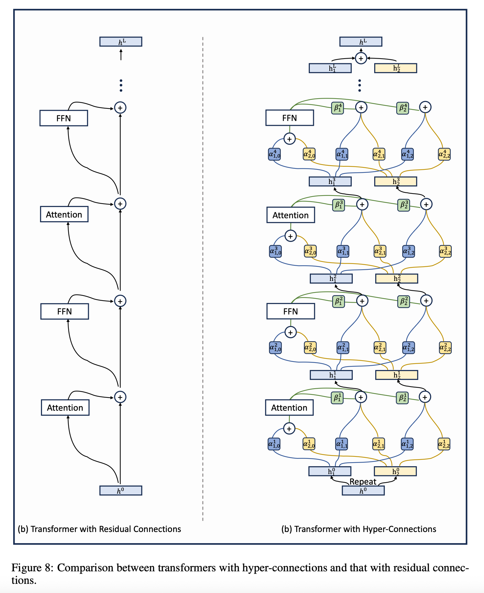

\[2024-09]\[HC] Hyper-Connections

# \[HC] Hyper-Connections

## 概述

你好！很高兴能为你解读这篇来自字节跳动 Seed 团队的 ICLR 2025 论文——**《Hyper-Connections》（超连接）**。

残差连接（Residual Connections）自 2015 年诞生以来，一直是深度学习（尤其是 Transformer）的基石。但这篇论文告诉我们：**“加法”可能不是最优解**。

以下是对这篇论文的深度拆解：

***

### 1. 本论文要解决什么问题？为什么重要？

**核心问题：解决深度神经网络中“梯度消失”与“表示崩溃”的跷跷体（Seesaw）效应。**

在训练极深的模型（如大语言模型 LLM）时，我们通常有两种选择：

*   **Pre-Norm（层前归一化）：** 训练很稳定，但随着层数加深，深层网络会变得非常“懒”，每一层都在简单重复上一层的信息，这叫\*\*“表示崩溃”\*\*（Representation Collapse）。
*   **Post-Norm（层后归一化）：** 表达能力强，但非常难训练，容易发生\*\*“梯度消失”\*\*，导致模型根本跑不起来。

**为什么重要？** 目前几乎所有的 Transformer 模型（如 GPT、Llama）都默认使用 Pre-Norm。如果能打破这个跷跷板效应，既能保持训练的稳定性，又能让深层网络真正学到东西，模型的效率和性能将会产生质的飞跃。

***

### 2. 解决这个问题的难点在哪里？之前的方案有什么不足？

**难点：** “稳定性”和“表达能力”在传统架构里是互斥的。如果你给残差分支更大的权重，模型就容易崩；如果你给得太小，深层网络就成了摆设。

**之前的解决方案：**

1.  **精心设计的初始化方案：** 比如调整权重初始化的缩放比例。但这种方案是“静态”的，无法适应训练过程中动态变化的数据。
2.  **特定的架构变体（如 ResiDual, Altup）：** 论文中提到了这些尝试。它们虽然想结合 Pre-Norm 和 Post-Norm 的优点，但往往增加了计算复杂度，或者在长期训练（如 500B tokens）中表现不如基准模型。

**根本原因：** 传统的残差连接是\*\*“手工写死的”\*\*（$x + f(x)$），它预定义了输入和输出的融合比例，缺乏灵活性。

***

### 3. 本论文提出了何种解决方案？

论文提出了 **Hyper-Connections (HC)** 及其动态版本 **Dynamic Hyper-Connections (DHC)**。

**核心思路：** 既然“写死”的比例不好用，那就**让网络自己学习每一层应该如何连接**。

*   **引入扩展率$n$：** 它不再只维护一个隐藏状态，而是将输入复制成  $n$  份（比如  $n=2$  或  $4$ ）。

*   **可学习的矩阵：** 通过一个专门设计的矩阵$HC$来控制这些状态如何混合。

    *   **深度连接（Depth-connections）：** 控制每一层输出对后续层的影响（解决纵向融合）。

    *   **宽度连接（Width-connections）：** 控制这  $n$  个状态之间的信息交换（解决横向交互）。

*   **动态调整（DHC）：** 最牛的地方在于，这些连接权重不是固定不变的，而是**根据当前输入的 Token 实时计算**出来的。这意味着模型可以为不同的词选择不同的网络拓扑结构。

***

### 4. 方案的核心创新点在哪里？

1.  **从“加法”进化为“可学习矩阵”：** 传统的  $y = x + f(x)$  变成了  $y = \text{Matrix}(x, f(x))$ 。

2.  **串行与并行的统一（Duality）：** 论文在理论上证明了，通过改变这个矩阵的权重，Hyper-Connections 可以随时在“串行架构”（一层接一层）和“并行架构”（多层同时处理）之间切换或软混合（见论文第 5 页图 4）。

3.  **极低的额外代价：** 虽然听起来增加了矩阵运算，但由于这些权重只是标量或极小维度的线性变换，**参数量只增加了不到 0.1%，计算量（FLOPs）增加也几乎可以忽略不计**。

4.  **1.8 倍加速：** 实验显示，使用 DHC 的模型收敛速度比基准模型快了 1.8 倍，且最终性能显著超越 baseline。

***

### 5. 本方案有什么局限性？

1.  **显存占用（Memory Footprint）：** 这是最显著的劣势。由于引入了扩展率  $n$ ，在训练期间需要存储更多的中间激活值。论文表 9 显示， $n=4$  时，显存占用增加了约 **26%**。这对于显存本来就紧张的大模型训练是个挑战。

2.  **实现复杂度：** 相比简单的 `x + layer(x)`，DHC 需要更复杂的代码逻辑来管理多个隐藏状态和动态权重。

3.  **超参数敏感性：** 扩展率  $n$  的选择需要权衡。虽然  $n=4$  效果很好，但进一步增加  $n$  带来的收益会边际递减，而成本却在增加。

***

### 6. 关键架构图解析

请看**第 14 页的 Figure 8**（这是理解该论文的灵魂图）： 

*   \*\*左侧 (b) Transformer with Residual Connections：\*\*这是我们熟悉的标准 Transformer。数据像爬梯子一样，一层层向上走，每过一个 Attention 或 FFN 层，就做一次简单的残差加法。连接非常单一。

*   \*\*右侧 (b) Transformer with Hyper-Connections：\*\*你会看到密密麻麻的线条和彩色小方块（$\alpha, \beta$）。

    *   **多条路径：** 注意到中间有两条并行的纵向轨道（ $h_1, h_2$ ），这代表扩展率  $n=2$ 。

    *   **复杂的交织：** 每一个计算层（Attention/FFN）不再只接受上一个位置的输入，而是从多个状态中取加权平均。

    *   **动态开关：** 那些标有  $\alpha, \beta$  的圆圈就是动态权重。它们就像是“自动分拣器”，根据数据的情况，决定这一层的输出是多给一点给第一个状态，还是多给一点给第二个状态。

**这张图告诉我们：** Hyper-Connections 将原本死板的线性“单行道”变成了灵活的“多车道高架桥”，网络可以根据路况（数据）动态分配车流。

***

### 总结给学生的话：

这篇论文的核心哲学是\*\*“动态化”\*\*。它认为神经网络不应该是一个固定结构的铁板，而应该是一组可以根据任务需求自动调整连接强度的灵活组件。虽然多花了一些显存，但换来了更快的学习速度和更强的表达能力。

## 思考一

1.  请解释一下Pre-Norm（层前归一化）和 Post-Norm（层后归一化），为什么层后归一化的表达能力强？
2.  残差连接和层前归一化和层后归一化有什么关系吗？
3.  解释一下可学习矩阵，以及什么是深度连接，什么是宽度连接？
4.  为什么通过扩展率扩展n份会提升效果？
5.  第5页图4的串行架构和并行架构是什么意思？
6.  在这个架构上训练时的数据流和工作流和经典基于残差连接的transformer有什么不同？ α,β是如何更新的？

***

这些问题问得非常精准！你已经触及了深度学习架构设计的核心。作为研究员，我最喜欢这种能深挖到原理的讨论。

我们一个一个来拆解：

### 1. Pre-Norm 与 Post-Norm：为什么后者表达能力强？

在 Transformer 的一个块（Block）里，通常包含“函数分支（如 Attention/FFN）”和“残差分支（直接连接）”。

*   **Post-Norm (层后归一化):** 公式大概是$x_{out} = \text{Norm}(x + f(x))$。

    *   **特点：** 归一化放在了加法之后。

    *   **表达能力强的原因：** 每一个层产生的“新信息”  $f(x)$  都会直接加到主干上，且没有被提前缩放。这保证了深层网络依然能对信号产生强有力的干预。

    *   **缺点：** 容易梯度爆炸或消失，因为导数链条上 Norm 层的摆放位置让训练非常不稳定。

*   **Pre-Norm (层前归一化):** 公式大概是$x_{out} = x + f(\text{Norm}(x))$。

    *   **特点：** 归一化放在函数分支之前。

    *   **为什么表达能力弱（表示崩溃）：** 随着层数增加，主干路径上的信号  $x$  越积越多，而每一层  $f(x)$  产生的贡献相对于庞大的主干  $x$  变得越来越微不足道。就像一桶水里加一滴墨水，层数越深，墨水（新学到的特征）越看不见，网络最后变得只是在简单重复传递输入，没学到新东西。

### 2. 残差连接与这两者的关系？

**残差连接是“骨架”，Norm（归一化）是“交通管制”。**

*   **残差连接（Residual Connection）：** 解决了“信息传递”的问题，让梯度可以走“捷径”回传。
*   **Norm：** 解决了“信号规模”的问题，防止数值飞出天际。
*   **关系：** Pre-Norm 和 Post-Norm 实际上是**残差连接的两种变体**。这篇论文在第 4 页（3.1 节）给出了数学证明：**当你把扩展率$n$设为 1 时，Hyper-Connections 就可以退化成 Pre-Norm 或 Post-Norm。** 这意味着 Hyper-Connections 是这两者的“超集”，涵盖并超越了它们。

### 3. 什么是可学习矩阵、深度连接和宽度连接？

在论文的第 3 页，作者定义了一个 $HC$ 矩阵（公式 1）。你可以把它想象成一个\*\*“调音台”\*\*。

*   **可学习矩阵 ($HC$):** 这是一个包含多个参数（ $\alpha, \beta$ ）的矩阵。在训练过程中，模型会根据损失函数自动调整这些参数，找到最适合当前任务的“连接方案”。

*   **深度连接 (Depth-connections):**

    *   对应矩阵中的第一行  $\mathbf{B}$ 。

    *   **功能：** 它决定了当前这一层的输出（比如 Attention 的结果）应该以多大的比例贡献给后面不同的隐藏状态。这控制了信息在纵向（层与层之间）的流动。

*   **宽度连接 (Width-connections):**

    *   对应矩阵中的  $\mathbf{A}_m$  和  $\mathbf{A}_r$  块。

    *   **功能：** 因为现在我们有  $n$  个隐藏状态（多条车道），宽度连接负责让这些车道之间进行信息交换。比如，第一条车道的信息可以流向第二条车道。

### 4. 为什么扩展 n 份（扩展率）会提升效果？

这其实是\*\*“冗余与特化”\*\*的力量。

*   **单一状态的局限：** 传统的残差连接只有一个隐藏状态  $x$ ，它必须同时负责传递原始信息和存储新学到的特征。这很累，容易顾此失彼。

*   **多状态（$n > 1$）的好处：**

    1.  **分工明确：** 不同的隐藏状态可以各司其职。比如  $h_1$  专门模仿 Pre-Norm 的稳定， $h_2$  专门模仿 Post-Norm 的高表达力。

    2.  **打破跷跷板：** 论文提到，当  $n=1$  时，跷跷板效应（梯度消失 vs 表示崩溃）无法根治。当  $n>1$  时，网络有了更多的“空间”去同时优化稳定性和表达力。

    3.  **模式记忆：** 模型可以利用不同的  $n$  份拷贝来保留不同层级的特征，防止旧特征被新特征彻底覆盖。

### 5. 图 4：串行架构 vs 并行架构

这是这篇论文非常有趣的理论贡献：

*   **串行架构 (Sequential):** 这是标准模式。第一层的输出作为第二层的输入。每一层都在前一层的成果上继续加工。
*   **并行架构 (Parallel):** 第一层和第二层**同时**处理同一个输入，然后把它们的结果加在一起。这有点像“专家会诊”，大家一起看同一个病例，最后综合意见。
*   **Hyper-Connections 的魔力：** 通过调整矩阵里的权重，模型可以**动态地**在某一层表现得像串行，在另一层表现得像并行。它甚至可以创造出既不是纯串行也不是纯并行的“中间形态”。

### 6. 数据流与更新机制：它和经典 Transformer 有什么不同？

#### **工作流对比：**

*   **经典 Transformer:**

    1.  输入  $x$  $\to$  2. 做归一化  $\to$  3. 进函数  $f(x)$  $\to$  4. 结果加回  $x$  。数据像单链条一样流动。

*   **Hyper-Connections (见第 28 页算法 1):**

    1.  **宽度混合：** 把上层的  $n$  个状态（矩阵  $\mathbf{H}$ ）用  $\mathbf{WC}$  矩阵进行横向混合，选出本层计算所需的输入  $h_0$ 。

    2.  **层计算：** 把  $h_0$  喂给 Attention 或 FFN，得到输出。

    3.  **深度分发：** 使用  $\mathbf{B}$  向量和  $\mathbf{A}_r$  矩阵，将这个输出和之前的原始信息重新分配到新的  $n$  个状态中，形成下一层的输入。

#### \*\*\alpha  \beta \*\* **是如何更新的？**

*   **如果是 Static（静态）：**  $\alpha, \beta$  就是普通的权重参数，和网络里的线性层权重一样，通过\*\*反向传播（Backpropagation）\*\*根据误差梯度直接更新。

*   **如果是 Dynamic（动态，即 DHC）：**

    *   $\alpha, \beta$  本身是由一个更小的、轻量级的神经网络（通常是一个线性层 + Tanh 激活）计算出来的。

    *   这个小网络的输入是当前的隐藏状态  $\mathbf{H}$ 。

    *   **更新方式：** 更新这个“计算权重的权重”。这样，模型就能学会在看到不同的词（Token）时，实时生成不同的  $\alpha$  和  $\beta$ ，从而改变连接结构。

简单来说，经典 Transformer 的连接是**钢筋焊死的**，而 Hyper-Connections 的连接是**活络的关节**，且带有一个自动控制系统。
